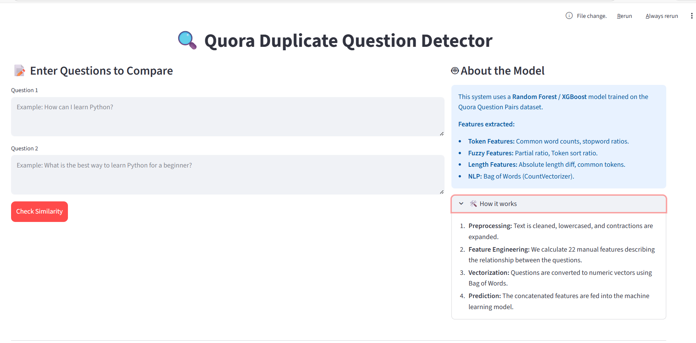

# 🔍 Quora Duplicate Question Pair Detector

[](https://www.python.org/)
[](https://streamlit.io/)
[](https://scikit-learn.org/)
[](https://en.wikipedia.org/wiki/Natural_language_processing)

A high-performance Machine Learning application designed to identify semantically identical questions. This project leverages advanced Natural Language Processing (NLP) and feature engineering techniques to detect if two questions from Quora are duplicates, helping platforms reduce redundancy and improve content quality.

---

## 🚀 Live Demo

Check out the live application here: [**Quora Duplicate Question Detector**](https://tejasd-13-quora-duplicate-question-detection-app-x5hrti.streamlit.app/)

---

## 🌟 Key Features

- **Semantic Analysis**: Goes beyond keyword matching to understand the intent of the questions.
- **Advanced Feature Engineering**: Utilizes 22+ custom-engineered features including fuzzy string matching and token analysis.
- **Interactive UI**: A sleek, user-friendly dashboard built with Streamlit for real-time predictions.
- **High Scalability**: Designed to handle large datasets and provide instant feedback.

---

## 🧠 How It Works

The system follows a multi-stage pipeline to transform raw text into meaningful insights:

### 1. Data Cleaning & Preprocessing
Before analysis, the text undergoes rigorous cleaning:
- **Normalization**: Lowercasing and whitespace trimming.
- **Contraction Expansion**: "I'm" → "I am", "won't" → "will not".
- **Noise Removal**: Eliminating HTML tags, special characters, and repeated punctuations.

### 2. Feature Engineering (The Secret Sauce)
The model's performance relies on three categories of features:

| Feature Category | Description |
| :--- | :--- |
| **Basic Features** | Length of questions, word counts, common words, and total unique words. |
| **Token Features** | Common word/stopword ratios (min/max), and first/last word matching. |
| **Fuzzy Features** | Fuzzy string matching (QRatio, Partial Ratio, Token Sort/Set Ratio) using Levenshtein distance. |
| **Text Vectorization** | Bag of Words (CountVectorizer) to capture structural patterns. |

### 3. Machine Learning Model
The final prediction is powered by a **Random Forest Classifier** (and tested with XGBoost), trained on over 400,000 question pairs. By combining manual feature engineering with text vectorization, the model achieves a high level of semantic understanding.

---

## 🛠️ Tech Stack

- **Data Science**: Python, Pandas, NumPy
- **Machine Learning**: Scikit-Learn, XGBoost
- **NLP Utilities**: NLTK, FuzzyWuzzy, BeautifulSoup, Distance
- **Web App**: Streamlit

---

## 🚀 Getting Started

### Prerequisites
- Python 3.8 or higher
- `pip` package manager

### Installation

1. **Clone the repository**
   ```bash
   git clone https://github.com/TejasD-13/Quora-Duplicate-Question-Detection.git
   cd "Duplicate Question pair"
   ```

2. **Install dependencies**
   ```bash
   pip install -r requirements.txt
   ```

3. **Launch the application**
   ```bash
   streamlit run app.py
   ```

---

## 📊 Performance Metrics

| Model Approach | Accuracy |
| :--- | :--- |
| Bag of Words (Only) | ~73% |
| BOW + Basic Features | ~76% |
| **Full Feature Engineering (Current)** | **~80%+** |

---

## 🖼️ Screenshots

<div align="center">
  
</div>

---

## 🤝 Contributing

Contributions are welcome! If you have ideas for improving the features or the model, feel free to open an issue or submit a pull request.

1. Fork the Project
2. Create your Feature Branch (`git checkout -b feature/AmazingFeature`)
3. Commit your Changes (`git commit -m 'Add some AmazingFeature'`)
4. Push to the Branch (`git push origin feature/AmazingFeature`)
5. Open a Pull Request

---

## 👤 Author

**Tejas Divekar**  
[GitHub Profile](https://github.com/TejasD-13)

---
*Developed for the NLP Quora Challenge.*